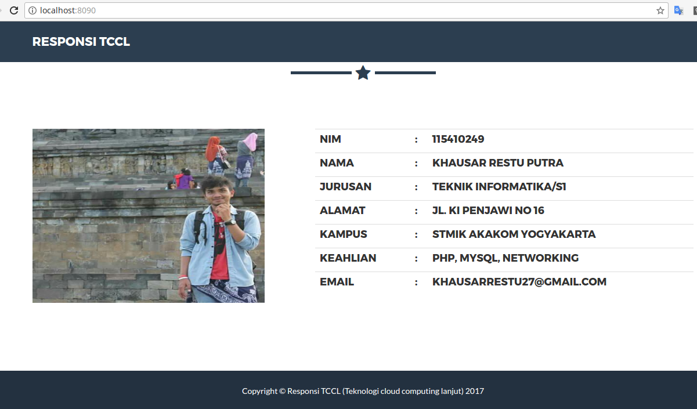
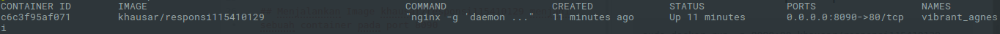

# Responsi TCCl

## Menampilkan halaman web static menggunakan Docker

## Membuild Images
#### membuat file Dockerfile
~~~bash
FROM alpine:latest

MAINTAINER khausar <khausarrestu27@gmail.com>

RUN apk add --update nginx && rm -rf /var/cache/apk/*
RUN mkdir -p /tmp/ngin/client-body
RUN mkdir -p /var/www

COPY nginx/nginx.conf /etc/nginx/nginx.conf
COPY nginx/default.conf /etc/nginx/conf.d/default.conf

COPY website /var/www

CMD ["nginx", "-g", "daemon off;"]
~~~
~~~bash
sudo docker build -t khausar/responsi115410129 .
~~~
Dan hasilnya kira kira seperti di bawah ini
~~~bash
Sending build context to Docker daemon  2.257MB
Step 1/9 : FROM alpine:latest
 ---> 7328f6f8b418
Step 2/9 : MAINTAINER khausar <khausarrestu27@gmail.com>
 ---> Running in 660afe74ae67
 ---> 5281ca7cc817
Removing intermediate container 660afe74ae67
Step 3/9 : RUN apk add --update nginx && rm -rf /var/cache/apk/*
 ---> Running in 2a1aef75ef56
fetch http://dl-cdn.alpinelinux.org/alpine/v3.6/main/x86_64/APKINDEX.tar.gz
fetch http://dl-cdn.alpinelinux.org/alpine/v3.6/community/x86_64/APKINDEX.tar.gz
(1/2) Installing pcre (8.40-r2)
(2/2) Installing nginx (1.12.1-r0)
Executing nginx-1.12.1-r0.pre-install
Executing busybox-1.26.2-r5.trigger
OK: 5 MiB in 13 packages
 ---> 58e1689f557d
Removing intermediate container 2a1aef75ef56
Step 4/9 : RUN mkdir -p /tmp/ngin/client-body
 ---> Running in c28af7fcbefc
 ---> ecec1711fbd7
Removing intermediate container c28af7fcbefc
Step 5/9 : RUN mkdir -p /var/www
 ---> Running in fd9bd24d7d41
 ---> 1689f062551c
Removing intermediate container fd9bd24d7d41
Step 6/9 : COPY nginx/nginx.conf /etc/nginx/nginx.conf
 ---> c874ba8f15ae
Removing intermediate container a4886ef0b80b
Step 7/9 : COPY nginx/default.conf /etc/nginx/conf.d/default.conf
 ---> 5583a7b1e6a2
Removing intermediate container 578239d380e5
Step 8/9 : COPY website /var/www
 ---> 943851266fd2
Removing intermediate container b67d047dcf14
Step 9/9 : CMD nginx -g daemon off;
 ---> Running in f2de0302c805
 ---> 894736a72958
Removing intermediate container f2de0302c805
Successfully built 894736a72958
Successfully tagged khausar/responsi115410129:latest
~~~

## Menjalankan Image khausar/responsi115410129 menjadi sebuah container pada port 8090

~~~bash
sudo docker run -p 8090:80 khausar/responsi115410129
~~~

